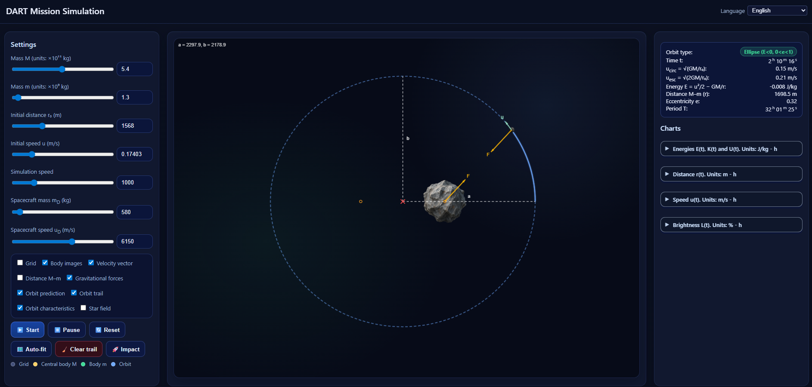
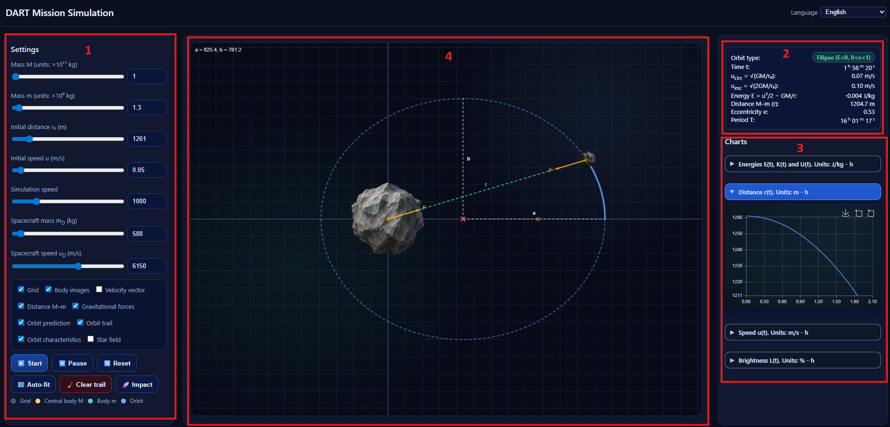

<p align="center">
  
  <br>
  <em>Overview of the DART Mission Simulation interface.</em>
</p>

The goal of this project is to provide an interactive, browser-based simulation inspired by NASA’s **Double Asteroid Redirection Test (DART)**.  
Students and teachers can use it to explore how gravity shapes asteroid orbits, how a kinetic impactor can change an orbit, and how these changes can be detected through brightness measurements, just as in real planetary-defence missions.

The simulation runs entirely in the browser and lets the user adjust physical parameters (masses, distances, speeds), trigger a DART-like impact, and observe the resulting changes in orbit type, energy, eccentricity and light curve.  
The rest of this document is organised as follows:

* **Section 1** introduces asteroids and the basic ideas of planetary defence.  
* **Section 2** summarises the DART mission and why it matters.  
* **Section 3** presents the core physics of orbital motion and impact.  
* **Section 4** explains how to use the simulation interface step by step.  
* **Section 5** describes the technical implementation and how the code can be modified.

<p align="center">
  <a href="https://paulgai.github.io/DART-Mission-Simulation/" target="_blank"
     style="display:inline-block;padding:10px 18px;background-color:#0b5ed7;color:#ffffff;border-radius:6px;text-decoration:none;font-weight:600;">
    Open the DART Mission Simulation
  </a>
</p>


# **1. Asteroids and Planetary Defense**

Asteroids are rocky bodies that orbit the Sun, ranging in size from a few meters to hundreds of kilometers. Most of them pose no threat to Earth, yet their long-term trajectories can change due to gravitational interactions, collisions with smaller objects, or even the subtle push of sunlight (the Yarkovsky effect). For this reason, space agencies continuously track thousands of **Near-Earth Objects (NEOs)** to assess whether any of them could one day approach our planet too closely.

Although impacts large enough to cause global damage are extremely rare, even a small asteroid—tens or hundreds of meters across—can generate significant regional destruction. The 2013 Chelyabinsk meteor, only about 20 meters in diameter, produced a shockwave that shattered windows across an entire city. Events like this highlight the importance of understanding how asteroids move and how we might intervene if one were ever found on a threatening path.

This is where **planetary defense** comes in. Planetary defense refers to all scientific, technological, and international efforts aimed at detecting potentially hazardous asteroids and developing strategies to prevent a collision with Earth. These strategies can include:

* **Orbital tracking and early prediction**, using telescopes and radar
* **Modeling asteroid structure and composition**, to understand how they behave physically
* **Deflection techniques**, which attempt to slightly change an asteroid’s orbit so it no longer intersects Earth

Among the proposed deflection methods, one of the most promising—and simplest—is the **kinetic impactor**: sending a spacecraft to collide with an asteroid to gently nudge it onto a safer path. Even a very small change in speed, applied years in advance, can shift an asteroid’s trajectory enough to avoid impact.

Understanding these ideas helps students connect classroom physics—gravity, energy, motion—with real-world challenges. It also highlights why missions like NASA’s DART are not science fiction experiments, but part of a growing global effort to ensure that humanity is capable of protecting Earth from natural hazards.

<p align="center">
  
  <br>
  <em>Figure 1. Mapping of Near-Earth Objects (NEOs) discovered over the past 20 years.</em>
  <br>
  <sub>Image credit: <a href="https://www.jpl.nasa.gov/news/twenty-years-of-tracking-near-earth-objects/">NASA / JPL-Caltech</a></sub>
</p>

---

# **2. The DART Mission: Why It Mattered**

In September 2022, NASA carried out a historic experiment called **DART** — the *Double Asteroid Redirection Test*. It was the first real attempt in human history to change the orbit of a celestial body on purpose. Instead of relying on computer simulations or laboratory experiments, scientists tested a full-scale planetary-defense technique in space.

### **2.1 Why Did NASA Target Dimorphos?**

DART’s target was **Dimorphos**, a small moonlet orbiting a larger asteroid named **Didymos**. This asteroid pair was carefully chosen because:

* **It posed no danger to Earth.** Any change in Dimorphos’ orbit could not redirect it toward our planet.
* **It formed a natural laboratory.** Scientists could easily measure how Dimorphos’ orbital period around Didymos changed after impact.
* **Its size was realistic.** With a diameter of ≈160 m, Dimorphos represents the kind of asteroid that could cause regional devastation if it ever collided with Earth.

This made the Didymos–Dimorphos system a perfect testing ground for a controlled deflection experiment.

### **2.2 What DART Actually Did**

The DART spacecraft did not carry explosives or special equipment. Its mission was intentionally simple:

> **Hit Dimorphos at high speed and measure how much the impact changes its orbit.**

Traveling at about **6.1 km/s**, DART crashed into Dimorphos and transferred momentum to the asteroid — the same way a cue ball transfers momentum to another ball in billiards, but on a far grander scale.

### **2.3 What Scientists Measured After the Impact**

After the collision, telescopes on Earth and in space observed:

* A large cloud of *ejecta* (material thrown off the asteroid)
* A measurable change in brightness as Dimorphos moved in front of or behind Didymos
* Most importantly, a **significant change in the asteroid’s orbital period**

Before the impact, Dimorphos orbited Didymos once every **11 hours and 55 minutes**.
After the impact, its orbit became **shorter by about 33 minutes** — far more than the minimum expected change.

This confirmed that:

1. **Kinetic impactors can successfully alter an asteroid’s orbit.**
2. Ejecta leaving the asteroid surface can enhance the momentum transfer far beyond the spacecraft’s own momentum.
3. Planetary defense is not theoretical — it is achievable with existing space technology.

### **2.4 Why Is This Important for Students?**

The DART mission brings together several key physics concepts:

* gravitational attraction in a two-body system
* orbital motion and mechanical energy
* conservation of momentum
* how small velocity changes can accumulate into large orbital shifts

It also shows students a real example of science solving a global, long-term problem.
For many, DART is the first time they encounter physics not as abstract equations, but as something that directly affects the safety of our planet.
Below is **Section 3**, written in clear English for high-school students but rigorous enough to connect directly with your simulation’s physics engine.
It is structured in four short subsections, each aligned with the concepts computed in **physics.js**, **charts.js**, and the UI.

<p align="center">
  
  <br>
  <em>Figure 2. llustration of how DART's impact altered the orbit of Dimorphos about Didymos. Telescopes on Earth are used to measure the change in the orbit of Dimorphos to evaluate the effectiveness of the DART impact.</em>
  <br>
  <sub>Image credit: <a href="https://dart.jhuapl.edu/Mission/index.php">DART Mission</a></sub>
</p>

---

# 3. Orbital Dynamics and Impact Physics

This section summarises the core physics of motion in a central gravitational field, the classification of orbits as conic sections, and the effect of a kinetic impact on an orbiting body. We consider a two-body system where one body is much more massive than the other, $` M \gg m `$, so that the massive body can be treated as fixed at the origin.

## 3.1 Equation of Motion in a Central Gravitational Field

In a two-body system with $` M \gg m `$, the motion can be described by the position vector $`\vec r(t)`$ of the small body $`m`$ relative to the massive body $`M`$.  
The gravitational force is:

```math
\vec{F} = -\frac{GMm}{r^3}\,\vec{r}
````

where $`G`$ is the gravitational constant and $`r = |\vec r|`$.

Newton’s second law gives the equation of motion:

```math
m\ddot{\vec{r}} = -\frac{GMm}{r^3}\vec{r}
\quad\Rightarrow\quad
\ddot{\vec{r}} = -\frac{GM}{r^3}\vec{r}
```

Thus the gravitational acceleration is:

```math
\vec{a} = -\frac{GM}{r^3}\vec{r}
```

This is the standard central-force law for the Newtonian two-body problem.

Because the force is central, the motion always lies in a plane.
Using polar coordinates $`(r,\theta)`$, the motion is determined by:

* the **initial distance** $`r_0`$
* the **initial velocity vector** $`\vec u_0`$, decomposed into radial and tangential components

The tangential component determines the **angular momentum**, which together with the total speed fixes the orbit’s shape.

## 3.2 Energy, Angular Momentum and Orbit Classification

Two conserved quantities completely characterise the orbit in a central $`1/r^2`$ field:

### 1. Specific mechanical energy

```math
E = \frac{u^2}{2} - \frac{GM}{r}
```

where $`u = |\vec u|`$ is the speed.

### 2. Specific angular momentum

```math
h = r\,u_{\perp}
```

where $`u_\perp`$ is the tangential velocity component.

Given initial conditions:

```math
r(0) = r_0,\qquad u(0) = u_0
```

with $`u_0`$ tangential, we obtain:

```math
E = \frac{u_0^2}{2} - \frac{GM}{r_0},
\qquad
h = r_0 u_0
```

Orbit type follows from $`E`$:

* $`E < 0`$ : bound orbit (circle or ellipse)
* $`E = 0`$ : parabolic trajectory
* $`E > 0`$ : hyperbolic trajectory

Circular and escape speeds:

```math
u_{\text{circ}} = \sqrt{\frac{GM}{r_0}},
\qquad
u_{\text{esc}} = \sqrt{\frac{2GM}{r_0}}
```

Thus:

* If $`u_0 = u_{\text{circ}}`$, the orbit is exactly circular.
* If $`u_0 < u_{\text{circ}}`$, the orbit is an ellipse.
* If $`u_{\text{circ}} < u_0 < u_{\text{esc}}`$, the ellipse is more eccentric.
* If $`u_0 = u_{\text{esc}}`$, the trajectory is parabolic.
* If $`u_0 > u_{\text{esc}}`$, the trajectory is hyperbolic and the body escapes.

## 3.3 Eccentricity and Conic Sections

Eccentricity is defined by:

```math
e = \sqrt{1 + \frac{2Eh^2}{(GM)^2}}
```

Using initial conditions:

```math
e = \sqrt{1 + \frac{2E r_0^2 u_0^2}{(GM)^2}}
```

Interpretation of $`e`$:

* $`e = 0`$ → **circle**
* $`0 < e < 1`$ → **ellipse**
* $`e = 1`$ → **parabola**
* $`e > 1`$ → **hyperbola**

The polar form of the orbit:

```math
r(\theta) = \frac{p}{1 + e\cos(\theta - \theta_0)}
```

with:

```math
p = \frac{h^2}{GM}
```

Periapsis and apoapsis:

```math
r_{\text{peri}} = \frac{p}{1 + e},
\qquad
r_{\text{apo}} = \frac{p}{1 - e}
```

Thus $`r_0`$ and $`u_0`$ fully determine $`E`$, $`h`$, $`e`$, and therefore the entire conic orbit.

## 3.4 Keplerian Motion in Bound Orbits

For bound orbits ($`E < 0`$ and $`e < 1`$), the trajectory is an ellipse with semi-major axis:

```math
a = -\frac{GM}{2E}
```

Kepler’s Third Law gives the orbital period:

```math
T = 2\pi\sqrt{\frac{a^3}{GM}}
```

Mean motion:

```math
n = \sqrt{\frac{GM}{a^3}}
```

Mean anomaly:

```math
M(t) = M_0 + n t
```

Kepler’s equation:

```math
M = E - e\sin E
```

Parametric form:

```math
x' = a(\cos E - e)
```

```math
y' = a\sqrt{1 - e^2}\sin E
```

Radius:

```math
r = a(1 - e\cos E)
```

Velocity components:

```math
v_{x'} = -\frac{\sqrt{GMa}}{r}\sin E
```

```math
v_{y'} = \frac{\sqrt{GMa}}{r}\sqrt{1 - e^2}\cos E
```

## 3.5 Radial Motion and Free Fall

If the tangential velocity is negligible ($`u_0 \approx 0`$), then:

```math
h = r_0 u_0 \approx 0
```

The orbit becomes nearly radial. The motion satisfies:

```math
E = \frac{\dot r^2}{2} - \frac{GM}{r}
```

A sufficiently low-energy trajectory results in inward fall and collision.

## 3.6 Physical Radius and Collision Criterion

Assuming a spherical body of density $`\rho`$:

```math
M = \frac{4}{3}\pi R^3 \rho
```

Thus:

```math
R = \left(\frac{3M}{4\pi\rho}\right)^{1/3}
```

Collision occurs when:

```math
r(t) \le R
```

For an ellipse, collision occurs if:

```math
r_{\text{peri}} = \frac{p}{1+e} \le R
```

## 3.7 Kinetic Impact and Change of Orbit

For a perfectly inelastic impact:

```math
\vec{v}' = \frac{m\vec{v} + m_D\vec{v}_D}{m + m_D}
```

New specific mechanical energy:

```math
E' = \frac{\|\vec{v}'\|^2}{2} - \frac{GM}{r}
```

New angular momentum:

```math
h' = r\,u'_{\perp}
```

New eccentricity:

```math
e' = \sqrt{1 + \frac{2E' h'^2}{(GM)^2}}
```

Collision if:

```math
r'_{\text{peri}} \le R
```

A positive $`E'`$ with $`e' > 1`$ corresponds to hyperbolic escape.

---

# 4. Using the DART Orbital Simulation Environment

The interactive environment is organised into four numbered areas (see Figure 3):

1. **Area 1 – Settings**  
2. **Area 2 – Numerical orbit indicators**  
3. **Area 3 – Time-dependent plots (charts)**  
4. **Area 4 – Orbital visualisation canvas**

<p align="center">
  
  <br>
  <em>Figure 3. Layout of the DART mission simulation interface. Area 1: settings, Area 2: numerical indicators, Area 3: charts, Area 4: orbital visualisation.</em>
</p>

Each area focuses on a different aspect of orbital motion and impact physics, allowing students to adjust parameters, run the simulation and observe the physical consequences.

## 4.1 Area 1 – Settings (Initial Conditions and Display Options)

Area 1 contains all controls that define the initial state of the two-body system and the DART-like impact, as well as options that toggle visual elements on and off. Each slider or checkbox corresponds to a specific physical or graphical quantity.

**Language selector (persistent preference)**
The interface includes a language selector. The selected language is stored locally in the browser (via a cookie), so after a page refresh the simulation automatically loads the last chosen language.

### Initial conditions and impact parameters

**Mass of the primary body (M)**
Sets the mass of the central body (analogous to Didymos). A larger value of (M) strengthens the gravitational field and generally leads to shorter orbital periods for the same initial distance.

**Mass of the orbiting body (m)**
Controls the mass of the moonlet (analogous to Dimorphos). Although the orbital motion is dominated by the primary (assumption (M \gg m)), the value of (m) affects how strongly the orbit changes after the impact, because momentum must be conserved in the collision.

**Initial distance (r_0)**
Defines the starting radial distance of the small body from the primary. This distance is visible in Area 4 as the initial separation of the two bodies.

**Initial speed (u_0)**
Sets the magnitude of the initial orbital speed. In this model the initial velocity is always **perpendicular** to the radius vector ( \vec r ), so the motion starts with purely tangential velocity and **no radial component**.

**Simulation speed**
A time-scaling factor that speeds up or slows down the animation. Changing this value alters how fast the simulation runs on screen but does not change the underlying physics.

**Spacecraft mass (m_D)**
The mass of the impacting spacecraft.

**Spacecraft speed (u_D)**
The relative speed of the spacecraft at the moment of impact.

> **Model assumption – head-on impact:**
> The simulation always treats the collision as **head-on**. The spacecraft’s velocity is taken to be exactly opposite to the instantaneous velocity of the moonlet at the moment of collision. This idealised configuration maximises the change in orbital speed and simplifies the analysis of momentum transfer.

### Display options

The following checkboxes control the visual layers shown in Area 4:

* **Grid** – draws a background grid in world units to provide a clear distance scale.
* **Body images** – displays the two bodies using scaled images rather than simple shapes.
* **Point masses** – displays both bodies as simple filled circles (point-mass style), focusing on the idealised physics model.

  * If **Body images** are enabled, selecting **Point masses** automatically disables images, so that the two modes are not used simultaneously.
* **Velocity vector** – displays the instantaneous velocity of the moonlet as an arrow.
* **Distance M–m** – draws the line segment joining the primary and the moonlet to emphasise their separation.
* **Measure tool** – enables an interactive distance-measuring tool inside the canvas, based on two draggable points and a connecting segment. Distances are expressed using the grid scale.
* **Gravitational forces** – shows force vectors acting on the bodies.
* **Orbit prediction** – displays the analytic conic section computed from the initial conditions (dashed preview curve).
* **Orbit trail** – shows the path actually followed by the moonlet during numerical integration.
* **Closed-orbit characteristics** – when the orbit is bound, shows additional geometric information (e.g., ellipse axes and foci; for a circular orbit, centre and radius).

### Run controls

Area 1 also provides the main simulation actions:

* **Start / Pause** – runs or temporarily stops the simulation.
* **Reset** – resets the simulation state to the current settings (without reloading the page).
* **Restore DART mission values** – restores the default DART-inspired parameter set (equivalent to returning to the initial “mission” setup).
* **Clear trail** – clears the stored orbit trail while keeping the current motion.
* **Impact** – triggers the DART-like collision at the current moment, applying momentum transfer and updating the post-impact orbit.

By combining these options, students can progressively build up the visual representation of the system and focus on the features that are most relevant to the concept being taught.

## 4.2 Area 2 – Numerical Orbit Indicators

Area 2 presents the key numerical quantities that describe the orbit at any given instant. These values are updated in real time as the simulation runs and change immediately after an impact.

**Orbit type**  
Classifies the trajectory as an ellipse, circle, parabola, hyperbola, or radial fall. The classification is based on the sign of the specific mechanical energy and the value of the eccentricity:

- \(E < 0\), \(0 < e < 1\): elliptical orbit  
- \(E < 0\), \(e = 0\): circular orbit  
- \(E = 0\), \(e = 1\): parabolic trajectory  
- \(E > 0\), \(e > 1\): hyperbolic escape  
- negligible angular momentum: radial fall towards the primary

**Time**  
Shows the elapsed simulation time since the start of the run.

**Circular and escape speeds**  
Displays the theoretical circular and escape speeds at the initial radius \(r_0\),

```math
u_{\text{circ}} = \sqrt{\frac{GM}{r_0}}, \qquad
u_{\text{esc}} = \sqrt{\frac{2GM}{r_0}},
```
for direct comparison with the chosen initial speed \(u_0\).

**Specific mechanical energy**  
Reports the value of
```math
E = \frac{u^2}{2} - \frac{GM}{r},
```
per unit mass of the moonlet. This quantity is central for classifying orbits and for understanding how the impact alters the system.

**Distance \(M\)–\(m\)**  
The instantaneous separation \(r(t)\) between the two bodies.

**Eccentricity \(e\)**  
The dimensionless number that measures how “stretched” the orbit is. After the impact, students can immediately see how \(e\) changes and whether the orbit becomes more or less eccentric.

**Orbital period**  
Displayed only when the orbit is bound, elliptical, and does not intersect the primary’s surface. It represents the time required for one complete revolution.

## 4.3 Area 3 – Time-Dependent Plots

Area 3 contains interactive graphs that show how key physical quantities evolve with time. The user can zoom and pan within each graph to study specific intervals in more detail.

**Energy plot – \(E(t), K(t), U(t)\)**  
Shows the kinetic energy \(K(t)\), gravitational potential energy \(U(t)\), and total specific mechanical energy \(E(t) = K(t) + U(t)\). For an isolated two-body system the total energy remains constant. In the simulation this constancy is visible except at the instant of impact, when the spacecraft delivers momentum to the moonlet and the orbit is changed.

**Distance plot – \(r(t)\)**  
Displays the radial distance from the primary as a function of time. Elliptical orbits appear as periodic oscillations between periapsis and apoapsis; fall trajectories show a continuous decrease in distance; hyperbolic trajectories show the moonlet moving away to infinity.

**Speed plot – \(u(t)\)**  
Shows the magnitude of the orbital speed. This graph helps students see, for example, that speed is highest near periapsis and lowest near apoapsis, and how the impact modifies the speed curve.

**Brightness plot – \(L(t)\)**  
Simulates photometric observations similar to those used in the real DART mission.

> **Geometric assumption – position of Earth:**  
> The Earth is assumed to lie far away along the **positive y-axis** of the simulation. In other words, the observer looks at the system from “above” along the direction of the y-axis in Area 4.

With this geometry, the total brightness of the Didymos–Dimorphos system decreases slightly whenever the moonlet passes **in front of** the primary body as seen from Earth. In the simulation:

- When the moonlet crosses the y-axis with a positive y-coordinate and its projected x-coordinate lies within the projected disk of the primary,  
- The brightness \(L(t)\) drops to a value slightly below 1 (for example, to about \(0.95\)).

This behaviour reproduces the idea of a **light curve**: by observing periodic dips in brightness, astronomers can infer the orbital period and study changes in the orbit before and after the impact.

## 4.4 Area 4 – Orbital Visualisation Canvas

Area 4 is the main graphical canvas where the motion of the two bodies and the effect of the impact are visualised.

**Orbital motion**  
The moonlet’s position is updated by numerically integrating Newton’s law

```math
\vec a = -\frac{GM}{r^3}\,\vec r
```

with small time steps. The path traced out by the moonlet forms the **orbit trail**, which may be open or closed depending on the energy and eccentricity.

**Analytic conic preview**  
A dashed curve shows the ideal conic section (ellipse, parabola, or hyperbola) computed directly from the initial conditions \(r_0\) and \(u_0\). This geometric orbit does not yet include the effect of the impact. Comparing the dashed preview with the post-impact trail helps students distinguish between the “original” and “modified” orbits.

**Body sizes and collision radius**  
When body images are enabled, the physical radii of the asteroids are calculated from their masses, assuming a fixed density. This defines a **collision radius** around the primary. If the orbit passes inside this radius, a collision with the central body is considered to occur.

**Visualisation of the impact**  
When the **Impact** button is pressed:

1. The spacecraft collides head-on with the moonlet, with velocity opposite to its instantaneous velocity.  
2. A new velocity is computed from conservation of momentum, and the mass of the moonlet effectively includes the spacecraft.  
3. The simulation immediately recomputes the orbital energy, angular momentum and eccentricity.  
4. The orbit trail now follows the **new** trajectory, which may be more or less eccentric, or even switch from bound to unbound (or vice versa), depending on the chosen settings.

These visual cues in Area 4 make the abstract equations of Sections 3.1–3.7 tangible and help students see, step by step, how a relatively small change in velocity can result in a measurable change in orbital motion.

## 4.5 Summary of Built-In Physical Assumptions

To keep the simulation conceptually clear and suitable for classroom use, the following simplifying assumptions are built into the model:

1. **The initial velocity is always perpendicular to the radius vector**, so the moonlet begins with purely tangential motion and no radial component.  
2. **The impact is always head-on**, with the spacecraft velocity directly opposite to the moonlet’s instantaneous velocity at the moment of collision.  
3. **The Earth is located along the positive y-axis**, so that dips in the brightness curve correspond to the moonlet passing in front of the primary body from the observer’s point of view.

These assumptions allow students to focus on the core ideas of planetary defence: how gravity shapes orbits, how kinetic impactors work, and how small changes in velocity can be detected through careful observation of light curves.

---

# 5. Technical Implementation

This section summarises how the DART simulation was implemented: the technologies used, the file structure, the multilingual design, and how the application can be run and modified.

## 5.1 Technology Stack

The simulation is a **purely client-side web application**. It runs entirely in the browser and does not require a server-side component or database.

- **HTML5** – defines the page structure and the three main panels (Areas 1–4) of the interface.:contentReference[oaicite:0]{index=0}  
- **CSS** – provides layout and styling (dark theme, responsive panels, controls, and status cards).  
- **Modern JavaScript (ES modules)** – implements the physics model, numerical integration, drawing routines, user interface logic, orbit control and chart updates. Modules are loaded via `type="module"` in `index.html`.:contentReference[oaicite:1]{index=1}  
- **Apache ECharts** – an external plotting library loaded from a CDN, used to render the four interactive charts for energy, distance, speed and brightness.  

Because ES modules and `fetch()` are used, the simulation is intended to run from a simple HTTP server (local or online) rather than directly from the `file://` protocol.

## 5.2 File Structure and Module Responsibilities

At the top level the project contains:

- `index.html` – main HTML file that defines the layout, includes the language selector, the three UI panels (Areas 1–3) and the `<canvas>` for Area 4. It also loads ECharts, the internationalisation script and the main JS module.:contentReference[oaicite:3]{index=3}  
- `style.css` – the stylesheet (not shown here) responsible for the dark theme, grid-based layout, responsive behaviour, and visual details (cards, pills, sliders).

All JavaScript files are placed inside the `scripts/` folder:

- `config.js` – holds physical constants, simulation limits and rendering parameters (e.g. `G`, fixed time step, maximum number of steps, crash radius, maximum radius), as well as a function `createInitialState()` that initialises the simulation state (masses, initial distance, initial speed, spacecraft parameters, camera settings and various display flags).:contentReference[oaicite:4]{index=4}  
- `physics.js` – implements the core physics of a central gravitational field and the geometric preview of the conic orbit. It:
  - computes basic orbital quantities (energy, angular momentum, eccentricity, orbit type),  
  - defines the acceleration `acc(state, r)` used by the integrator,  
  - derives the physical collision radius from the mass and an assumed density,  
  - provides functions to precompute the preview trajectory and to compute summary parameters for the UI.  
- `draw.js` – handles all drawing on the `<canvas>`:
  - grid and axes,
  - central body and moonlet (either as small points or as images),
  - trajectory trail,
  - predicted conic orbit,
  - velocity vectors, force indicators and geometric constructions (e.g. semi-major axis, foci, etc.).  
- `ui.js` – connects the DOM elements (sliders, checkboxes, buttons) with the simulation state. It reads user input from Area 1, updates labels and numeric readouts, and exposes helper functions such as `initUI()` and `updateOrbitUI()` for use by other modules.:contentReference[oaicite:6]{index=6}  
- `orbitControl.js` – provides higher-level operations on the orbit:
  - `resetToInitial(state)` recomputes the preview trajectory, resets time, places the moonlet back at \(r_0\) with the initial tangential speed, clears the trail and updates the UI,  
  - `autoFit(state, canvas)` adjusts the zoom and centre so that the orbit fits neatly in the canvas.:contentReference[oaicite:7]{index=7}  
- `charts.js` – creates and manages the four ECharts plots:
  - energy plot \(E(t), K(t), U(t)\),
  - distance plot \(r(t)\),
  - speed plot \(u(t)\),
  - brightness plot \(L(t)\).  
  It defines common chart options (dark colours, tooltips, zoom/pan controls), buffers incoming data points, and periodically refreshes the plots while keeping a maximum number of stored samples for performance.  
- `i18n.js` and `i18n.json` – implement the multilingual layer (see Section 5.3).  

The `scripts/img/` directory contains the graphical assets used in the interface (asteroid images, DART infographic, UI screenshots).

The central coordinator is:

- `main.js` – the main entry point. It:
  - imports the configuration, drawing, physics, orbit control, charts and UI modules,  
  - creates the initial state via `createInitialState()`,  
  - initialises the charts and UI,  
  - sets up event listeners for mouse wheel zoom and panning on the canvas,  
  - runs the animation loop with `requestAnimationFrame`, updating the physical state, drawing the new frame in Area 4 and sending samples to the charts in Area 3,  
  - keeps the numeric indicators in Area 2 up to date (energy, orbital period, orbit type).:contentReference[oaicite:10]{index=10}  

This modular design separates concerns: physics, drawing, UI, charts and internationalisation are implemented in distinct files, making the codebase easier to understand and extend.

## 5.3 Multilingual Design

The simulation is fully multilingual and supports **eleven languages** (English, Greek, Spanish, French, German, Brazilian Portuguese, Italian, Arabic, Simplified Chinese, Japanese and Korean). All translations are stored in a single JSON file and applied dynamically at runtime.  

### 5.3.1 Language Resources

The file `scripts/i18n.json` contains a top-level object for each supported language:

```json
{
  "en": { ... },
  "el": { ... },
  "es": { ... },
  ...
}
```

---

## License and Attribution

This project is released under the **MIT License**, which allows free use, modification and redistribution of the code for both educational and research purposes, as well as in derivative projects and applications. The full license text is included in the `LICENSE` file of the repository.

Copyright © Pavlos Gaintatzis and Maria-Stavroula Belitsou

When using or adapting this simulation in teaching materials, research projects or presentations, please retain the original copyright and license notice and consider citing the repository or acknowledging the authors by name. Contributions, forks and extensions are warmly encouraged, as long as they preserve the MIT License terms.


